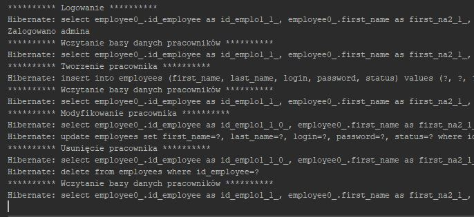

# GraduationWorkApp_Server

## Table of contents
* [General info](#general-info)
* [Technologies](#technologies)
* [Launch](#launch)
* [Additional information](#additional-information)

## General info
This is back-end application of simple project client-server. It accepts CRUD requests from the client's application, operates on a database and sends back data.

## Technologies
Project is created with:
* Java version: 8
* Maven version: 3.6.3
* Spring Boot version: 2.3.1.RELEASE
* Hibernate
* MySQL version: 8.0.20
* REST
* JSON
* MVC pattern

## Launch
Unpack the project, configure the database and run the project. Later, start the client application.

## Additional information
Features, to-do and project status are described in the client's repo:
[GraduationWorkApp_Client link](https://github.com/kondzrad/GraduationWorkApp_Client "App Client")